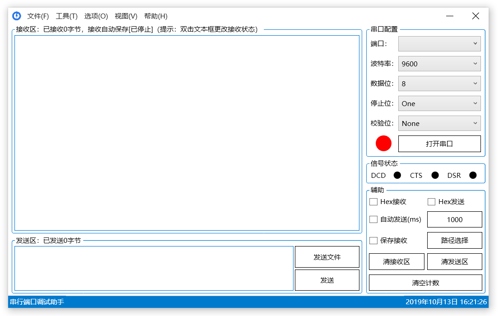

## OSDA - The Open Serial Debug Assistant

<p align="left">
    <a href="#License" alt="License"></a>
    <a href="#安装" alt="Platform"></a>
    <a alt="Version"></a>
</p>



## 架构

软件支持 WPF [Microsoft .NET Framework 4.6.1](https://dotnet.microsoft.com/download/dotnet-framework/net461) 和 WPF [Microsoft .NET Core 3.0.0]( https://dotnet.microsoft.com/download/dotnet-core/3.0 ) 两种框架，使用 MVVM 模型开发。


## 功能

- [x] 基础功能（打开、关闭、接收、发送、清接收区、清发送区和清空计数）
- [x] 十六进制（HEX）接收，十六进制（HEX）发送
- [x] 自动发送
- [x] 保存接收数据（可自定义保存位置）
- [x] 发送文件
- [x] 编码方式（ASCII，UTF-8，UTF-16，UTF-32）
- [x] 流控制（握手协议、控制协议）
- [x] 暂停接收
- [x] 发送新行（三种换行符）
- [x] 信号控制（RTS，STR）
- [x] 信号检测（DCD，CTS，DSR）
- [x] 在线更新
- [x] 精简视图（只保留接收区和发送区）
- [ ] 全球化和本地化

####  串口属性

* 串行端口传输前后的默认编码方式为 UTF-8 
* 串行端口输入缓冲区大小配置为 2MB
* 串行端口输出缓冲区大小配置为 1MB
* 串行端口默认流控制为 None（无控制流）
* 串行端口信号控制 Rts 和 Dtr 默认均未启用

## 安装

#### 先决条件

1. 仅支持 `Windows7 Service Pack 1(SP1)` 及以上版本（不支持 `Windows XP`）。`Windows7` 未安装 `SP1` 请  [点击此处](https://support.microsoft.com/zh-cn/help/15090/windows-7-install-service-pack-1-sp1) 根据网站页面描述下载安装（Microsoft官方网站）。

2. 已安装 `Microsoft .NET Framework 4.6.1` 。未安装请 [点击此处](https://dotnet.microsoft.com/download/dotnet-framework/net461) 根据网站描述下载安装（Microsoft官方网站）。

#### For Windows

下载最新的 [OSDA 安装程序](https://leven9.gitee.io/osdaweb/download.html)。可以选择从 `Gitee` 或 `Github` 站点下载。

## 编译

#### For Windows

- [ ] VS2015
- [x] VS2017（仅支持 .Framework 框架）
- [x] VS2019（支持 .Framework 和 .Core 两种框架）

```bash
$ git clone https://gitee.com/leven9/OSDA.git
$ cd OSDA/msvc
```
* 对于 VS2017 ，双击 `OSDA2017.Framework.sln` 
* 对于 VS2019 ` .Framework` 框架，双击 `OSDA2019.Framework.sln` 
* 对于 VS2019 `.Core` 框架，双击 `OSDA2019.Core.sln`

## 贡献

请参阅项目的贡献者指南（贡献者指南可以在 [GitHub](https://github.com/leven99/OSDA/blob/master/CONTRIBUTING.md) 或 [Gitee](https://gitee.com/leven9/OSDA/blob/master/CONTRIBUTING.md) 中找到）。

## License

软件采用 MIT License 授权（授权许可证可以在 [Github](https://github.com/leven99/OSDA) 或 [Gitee](https://gitee.com/leven9/OSDA) 中找到）。