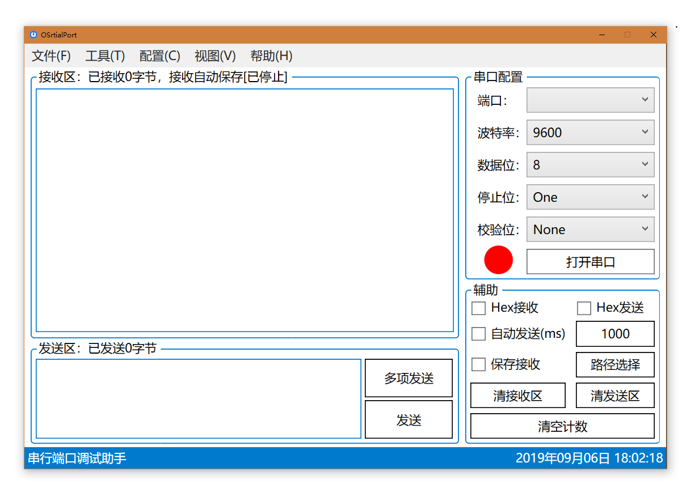

## OSerialPort - 串行端口调试助手

------

<p align="left">
    <a href="#编译" alt="build"></a>
    <a href="#For windows" alt="platform"></a>
    <a href="#开源执照" alt="lincense"></a>
</p>



## 架构

软件采用 WPF [Microsoft .NET Framework 4.6.1](https://www.microsoft.com/zh-CN/download/details.aspx?id=49982) 框架，MVVM 模型开发（代码逻辑与 `UI` 设计分离）。


## 功能

- [x] 完整的 MVVM 模型
- [x] 基础功能（打开、关闭、接收、发送、清接收区、清发送区和清空计数）
- [x] 十六进制（HEX）接收，十六进制（HEX）发送
- [x] 自动发送
- [x] 保存接收，路径选择
- [ ] 多项发送
- [x] 更改编码方式
- [x] 流控制（握手协议、控制协议）
- [x] 信号控制
- [x] 信号检测
- [ ] 检查更新

####  串口属性

* 软件串行端口传输的默认编码方式为 `UTF-8` （**重要**）
* 串行端口输入缓冲区大小配置为 2MB
* 串行端口输出缓冲区大小配置为 1MB
* 串行端口默认流控制为 `None`（无控制流）
* 串行端口信号控制  `Rts`  和 `Dtr` 默认未启用

## 安装要求

1. 仅支持 `Windows7 SP1` 及以上版本（不支持 `Windows XP`）。`Windows7` 未安装 `SP1` 请  [点击此处](https://support.microsoft.com/zh-cn/help/15090/windows-7-install-service-pack-1-sp1) 根据网站页面描述下载安装（Microsoft官方网站）。

2. 已安装 `Microsoft .NET Framework 4.6.1` 。未安装请  [点击此处](https://www.microsoft.com/zh-CN/download/details.aspx?id=49982) 下载（Microsoft官方网站）。

## 参与贡献

```bash
$ git clone https://gitee.com/leven9/OSerialPort.git
```

## 编译

### For windows

- [ ] VS2015
- [x] VS2017
- [x] VS2019

```bash
$ git clone https://gitee.com/leven9/OSerialPort.git
$ cd OSerialPort/msvc
```
对于 `VS2017` 双击 `OSerialPort2017.sln`，对于 `VS2019` 双击 `OSerialPort2019.sln` 即可。

## 错误疑问

有任何使用问题及疑问，请 [点击此处（issuse）](https://gitee.com/leven9/OSerialPort/issues) 反馈。

## 开源执照

软件采用 [MIT](https://gitee.com/leven9/OSerialPort/blob/master/LICENSE) 许可授权。